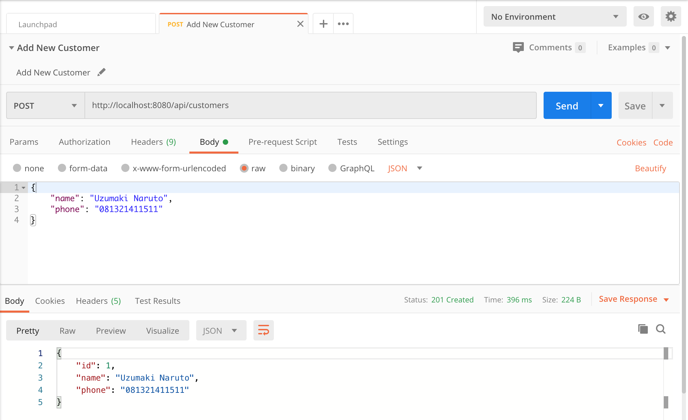
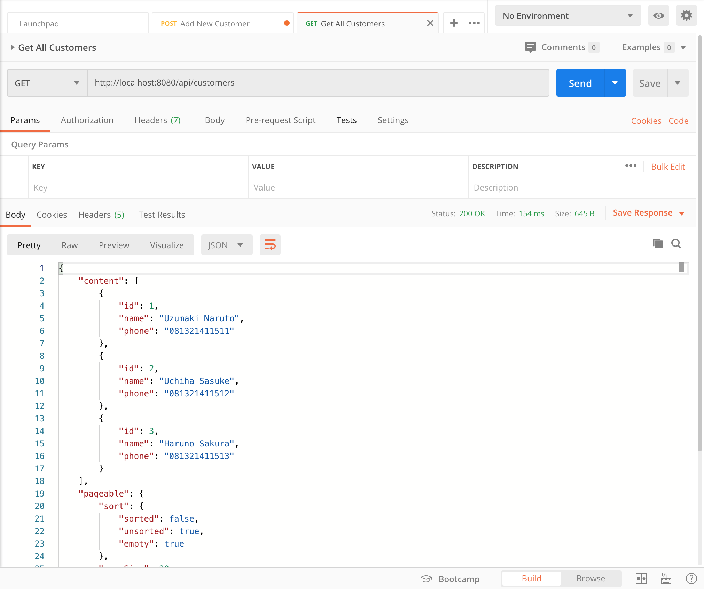
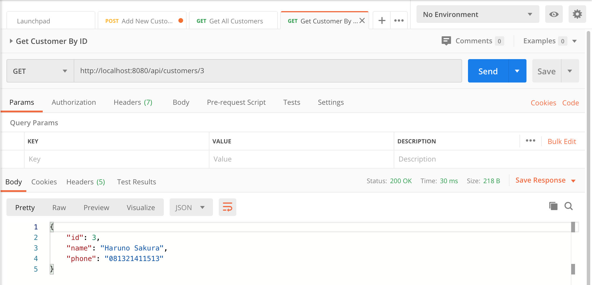
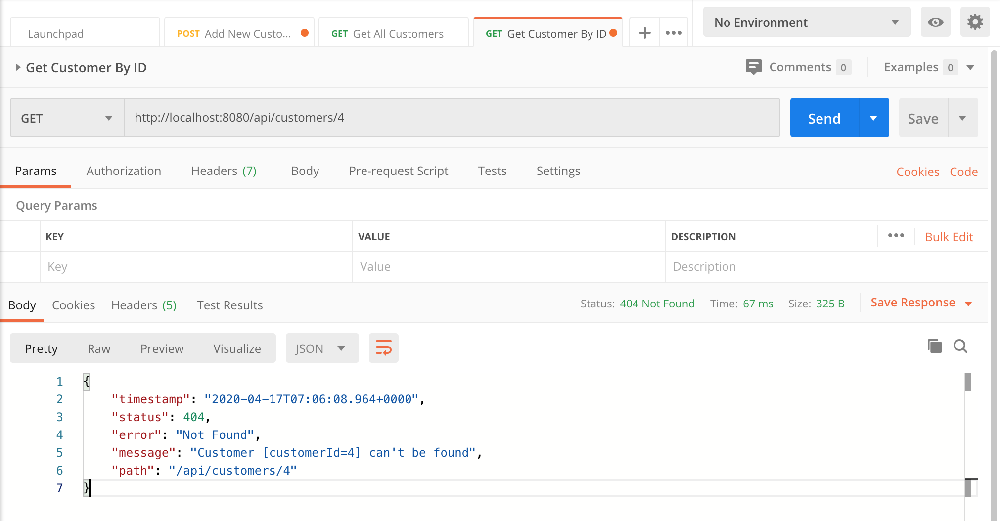
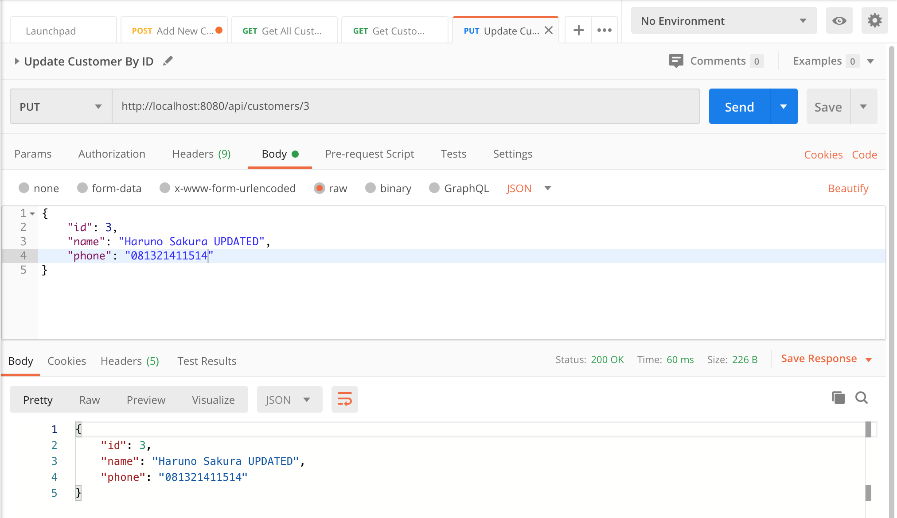
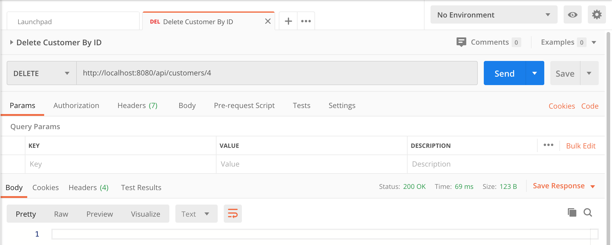
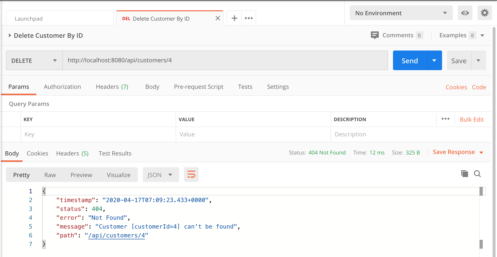

# spring-boot-crud-customer-rest-api-mysql

### Things todo list:

> I assume that you have installed Gradle & MySQL Database on your environment

1. Clone this repository: `git clone https://github.com/hendisantika/spring-boot-crud-customer-rest-api-mysql.git`.
2. Change MySQL credentials base on your system in `application.properties` file (No Need to create DB. It will be
   created automatically).
3. Go inside cloned folder: `cd spring-boot-crud-customer-rest-api-mysql`.
4. Run your application: `gradle clean bootRun --info` or you can use gradle wrapper: `/gradlew clean bootRun --info`.
5. Open POSTMAN App then import my POSTMAN Collection.

### Images Screen shot

Add New Customer

Get All Customers

Get Customer By ID

Not Found Customer Data

Update Customer Data

Delete Customer Data

Delete Customer Data Not Found

